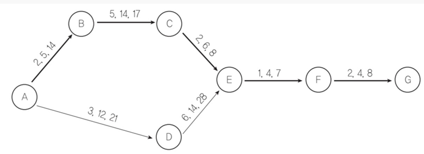
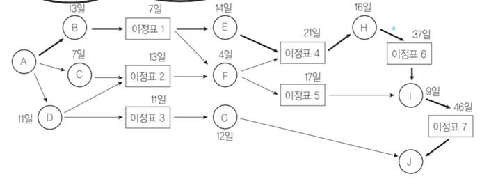

## 1. 소프트웨어 개발 방법론 테일러링

### 개발 방법론 테일러링 개요
> **정의**: 기존의 소프트웨어 개발 모델을 프로젝트 특성에 맞게 최적화하는 활동으로, 절차와 산출물의 가공, 적용, 정제를 반복적으로 수행한다.

**테일러링 필요성 판단 기준**
* **내부적 요건**: 목표 환경, 요구사항, 프로젝트 규모, 보유 기술
* **외부적 요건**: 법적 제약사항, 표준 품질 기준

### 테일러링 프로세스
1. 프로젝트 일정 및 자원 현황 반영
2. 개발 단계별 절차 수립
3. 매뉴얼 작성

---

## 2. 프로젝트 관리 및 일정 계획

### 소프트웨어 개발 프로젝트 관리 요소
인적 자원(People), 일정(Process), 문제 인식(Problem)을 기반으로 다음 5가지 요소를 관리한다.

1. **일정**: 활동 순서, 활동 기간 산정, 일정 개발, 일정 통제
2. **비용**: 원가 산정, 예산 편성, 원가 통제
3. **투입 자원**: 팀 편성 및 관리, 자원 산정, 조직 정의, 자원 통제
4. **위험**: 위험 식별, 위험 대처, 위험 통제
5. **품질**: 품질 계획, 품질 보증 수행, 품질 통제 수행

### 프로젝트 일정 관리 원칙
* 여러 작업으로 분할
* 작업 간 네트워크(선후 관계) 설정
* 작업별 시간 설정
* 프로젝트 참여 인원은 규모에 따라 프로젝트 시작 전 결정
* **Brooks의 법칙**: 프로젝트 진행 중 새로운 인원을 투입하면 적응 기간 등으로 인해 오히려 일정이 지연됨

### 프로젝트 일정 계획 방법론
소요 시간의 예측 가능성에 따라 불확실할 때는 PERT, 확실할 때는 CPM으로 나뉜다.

**1. PERT (Program Evaluation and Review Technique)**
* 작업 소요 시간이 불확실할 때 사용하는 방법
* $ 예측치(TE) = (낙관치(O) + 4기대치(M) + 비관치(P)) / 6 $

**2. CPM (임계 경로 기법, Critical Path Method)**
* 작업 소요 시간이 확실할 때 사용하는 방법
* **원형 노드**: 특정 작업의 완료 시점
* **박스 노드(이정표)**: 해당 이정표에 종속된 모든 작업이 완료되어야 다음 작업 진행 가능
* **임계 경로(주공정 경로)**: 작업 소요 시간이 **가장 오래 걸리는 경로**

**3. 간트 차트 (Gantt Chart)**
* 시간 흐름에 따른 막대그래프 형태
* 의존성 및 작업 문제 요인 파악이 어려움
* 소규모 프로젝트에 적합

---

## 3. 소프트웨어 비용 산정

### 비용 산정 개요 및 결정 요소
> **정의**: 소프트웨어 규모를 파악하여 개발에 필요한 비용을 미리 산정하는 활동. 비용이 너무 낮게 책정되면 개발자의 부담이 커지고 품질 저하로 이어진다.

**소프트웨어 비용 결정 요소**
* **프로젝트**: 제품 복잡도, 시스템 크기, 요구 신뢰도
* **자원**: 인적 자원, 하드웨어 자원, 소프트웨어 자원
* **생산성**: 개발자 역량, 개발 기간

### 소프트웨어 사업비 종류
1. 정보 전략 계획 수립 비용
2. 소프트웨어 개발 비용
3. 소프트웨어 유지 보수 비용
4. 소프트웨어 재개발 비용
5. 데이터베이스 구축 비용
6. 시스템 운영 환경 구축 비용

### 비용 산정 기법 분류

#### 1. 하향식 비용 산정 기법 (비과학적 기법)
과거의 경험을 기반으로 전체 비용을 먼저 산정하는 방식
* **전문가 측정 기법**: 둘 이상의 전문가가 비용 산정. 개인적이고 주관적인 판단이 포함될 수 있음.
* **델파이(Delphi) 측정 기법**: 전문가 측정 기법의 단점을 보완. 조정자(Coordinator)가 여러 전문가의 익명 의견을 종합하고 조율하여 비용 산정.

#### 2. 상향식 비용 산정 기법
세부적인 작업 단위별로 비용을 먼저 산정한 후 전체 비용을 합산하는 방식
* **단계별 노력 기법**: 각 기능을 구현하는 데 필요한 노력에 가중치를 부여하여 측정.
* **LOC (Line Of Code) 기법**: 각 기능의 소스코드 라인 수로 비용을 산정.
  * **예측치** = (낙관치 + 4 × 기대치 + 비관치) / 6
  * **노력(인월)** = 개발 기간 × 투입 인원 = LOC / 인당 월평균 생산 코드 라인
  * **개발 비용** = 노력 × 월평균 인건비
  * **개발 기간** = LOC / (인당 월평균 생산 코드 라인 × 투입 인원)
  * **생산성** = LOC / 노력

#### 3. 수학적 산정 기법
### 수학적 비용 산정 기법 요약

| 모델명 | 분류 기준 | 세부 내용 및 자동화 도구 |
| :--- | :--- | :--- |
| **COCOMO 모델** | LOC 기반 비용 산정 | - **Basic(기본형)**: Organic(조직형/5만 이하), Semi-Detached(반분리형/30만 이하), Embedded(내장형/30만 이상) - **Intermediate(중간형)**: 요구사항 복잡성, 팀 능력 등 추가 분석 - **Detailed(상세형)**: 개발 단계별 세부 분석 |
| **Putnam 모델** | 노력 분포도 기반 | - 개발 기간이 늘어날수록 투입 인원의 노력이 감소함 - 자동화 비용 측정 도구: **SLIM** |
| **기능 점수(FP) 기법** | 기능 증대 요인 기반 | - **증대 요인**: 입력, 출력, 사용자 질의, 데이터 파일, 인터페이스 - 자동화 비용 측정 도구: **ESTIMACS** |

---

## 4. 투입 인력 자원 구성

| 구분 | 책임 프로그래머 팀 (중앙 집중형) | 민주주의식 팀 (분산형) |
| :--- | :--- | :--- |
| **구조** | 1인 책임, 다수 보조 (Star 구조) | 개발 영역이 독립적 (Ring 구조) |
| **적합성** | 소규모 프로젝트, 단기적 개발 | 대규모 프로젝트, 장기적 개발 |
| **팀원 특성** | 만족도 낮음, 이직률 높음 | 만족도 높음, 이직률 낮음 |

---

## 5. 소프트웨어 품질 
| 표준명 | 설명 및 핵심 내용 |
| :--- | :--- |
| **ISO/IEC 12207** | 소프트웨어 생명 주기 프로세스 (기본, 지원, 조직) |
| **ISO/IEC 12119** | 패키지 소프트웨어 품질 요구사항 및 테스트 |
| **ISO/IEC 29119** | 소프트웨어 테스트 |
| **ISO/IEC 9126 (25010)** | - 소프트웨어 품질 특성 및 평가 - **6대 외부 품질**: 기능성, 신뢰성, 사용성, 효율성, 유지보수성, 이식성 |

### 프로세스 평가 모델 비교 (CMM / CMMI / SPICE)

**1. CMM (Capability Maturity Model)**
* **특징**: 업무 능력 평가 기준을 세우기 위한 성숙도 모델. 소프트웨어 자체 품질과 직접 연관성은 없으며, 소규모 업체 적용은 비효율적이다.
* **프로세스 성숙도**: 초기 → 반복 → 정의 → 관리 → 최적화
* **관리 품질 평가 기준**: 
  1. 레벨1(혼돈적 관리): 순서 일관성 부재
  2. 레벨2(경험적 관리): 경험을 통한 관리
  3. 레벨3(정성적 관리): 경험 공유 및 공식적 관리
  4. 레벨4(정량적 관리): 통계적 분석을 통한 관리
  5. 레벨5(최적화 관리): 위험 예측 및 최적화 도구 활용

**2. CMMI (Capability Maturity Model Integration)**
* **특징**: CMM의 발전형으로 시스템 공학 역량 성숙도 평가 통합. (SW-CMM, SE-CMM, IPD-CMM)
* **프로세스 성숙도**: 초기 → 관리 → 정의 → 정량적 관리 → 최적화

**3. SPICE (ISO/IEC 15504)**
* **목적**: 1) 개발 기관 스스로 프로세스 개선 평가, 2) 요구 조건 만족 여부 자체 평가, 3) 계약을 위한 수탁 기관 프로세스 평가
* **성숙도**: 레벨0(불완전) → 레벨1(수행) → 레벨2(관리) → 레벨3(확립) → 레벨4(예측 가능) → 레벨5(최적)

### CASE (Computer Aided Software Engineering) 도구
* **특징**: 소프트웨어 개발 프로세스 전 과정을 자동화하여 반복적인 작업량을 줄이는 도구.
* **장단점**: 도구 도입 비용은 비싸나 전체 개발 비용과 기간은 절감됨. 명령어/문법 숙지가 필요하며 도구 간 호환성이 없음.
* **목표**: 소프트웨어 재활용성 수준 향상, 점진적 개발 지원, 유지보수 및 생산성 향상.

**주요 CASE 도구**
1. **SADT**: SoftTech에서 개발, 블록 다이어그램을 채택한 자동화 도구
2. **SREM**: TRW에서 개발, 요구 분석용 도구
   * **RSL**: 요소 속성, 관계, 구조들을 기술하는 요구사항 기술언어
   * **REVS**: RSL로 기술된 요구사항 분석 명세서를 출력하는 분석 시스템
3. **TAGS**: 시스템 공학 방법 응용에 대한 자동 접근 방식
4. **PSL/PSA**: 미시간 대학에서 개발, 요구 분석용 도구 (PSL: 기술 언어, PSA: 분석 시스템)

---

## 6. 프로젝트 형상 관리 (Configuration Management)

> **정의**: 소프트웨어 개발 프로젝트 전 과정에서 발생하는 산출물들의 종합 및 변경 과정(버전 관리)을 체계적으로 관리하고 유지하는 활동. 여러 개발자의 동시 작업으로 인한 문제를 최소화한다.

**형상 관리 프로세스**
1. **형상 식별**: 형상 관리 대상을 식별하고 관리 번호를 부여하며, 추적을 위한 기준선(Baseline)을 정하는 활동
2. **형상 통제**: 변경 요구를 검토하고 승인하는 작업으로, 베이스라인 반영을 제어함. 형상통제위원회 등 별도 조직의 승인을 통해 이루어짐.
3. **형상 상태 보고**: 형상 관리 작업의 결과를 기록하고 관리함
4. **형상 감사**: 변경될 베이스라인의 무결성을 공식적으로 승인하기 위해 검증함